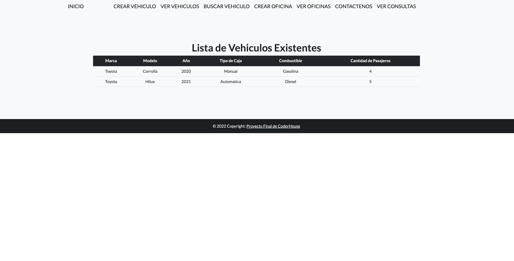
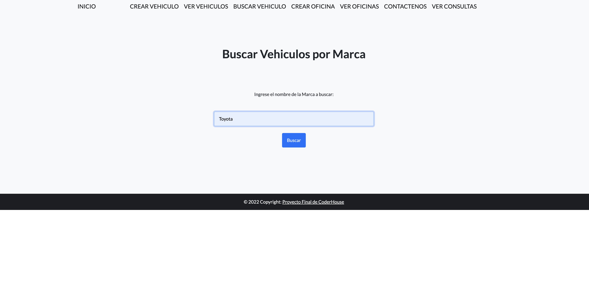
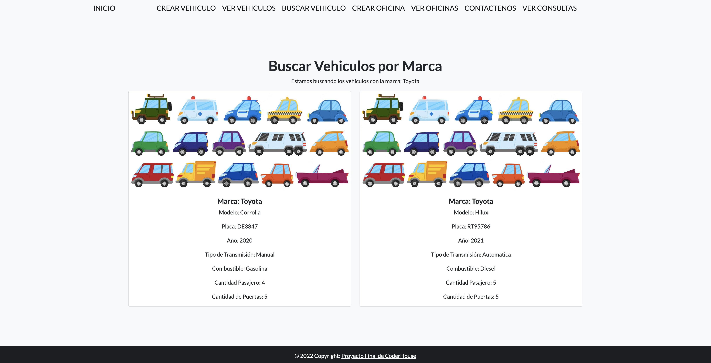
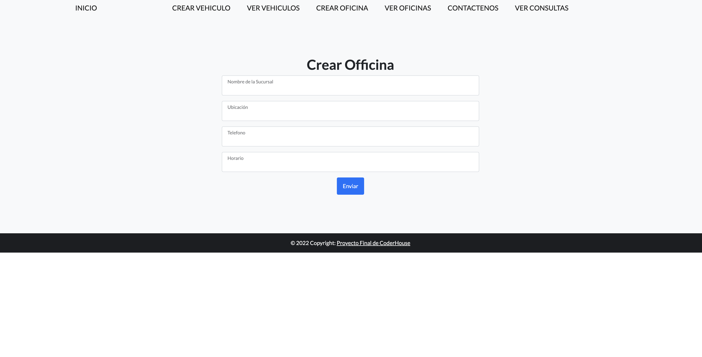
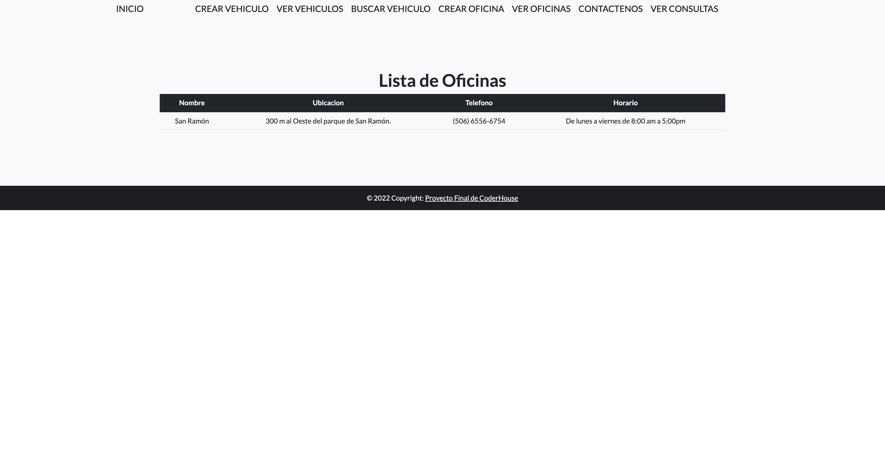
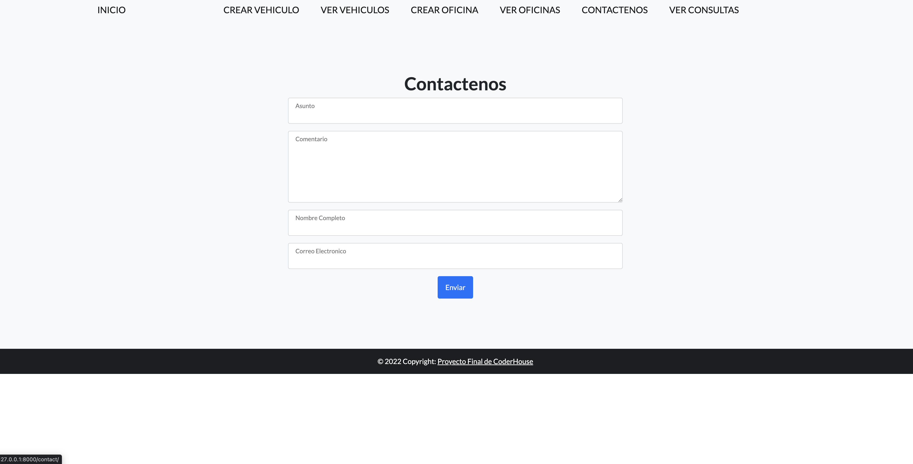
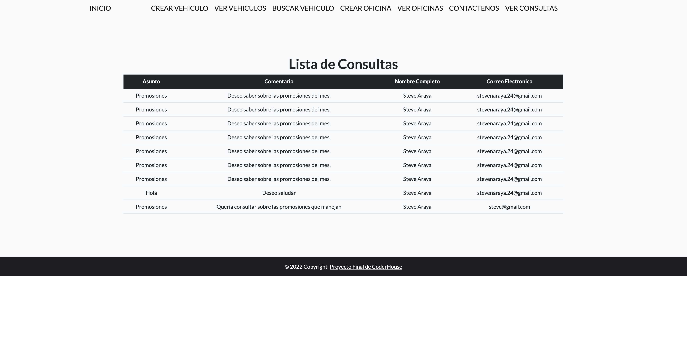

# Proyecto final CoderHouse
    Plataforma web para la reserva de vehículos automotores. Además, la misma cuenta con una sección de Posts (tipo Blog), donde se pueden
    encontrar distintos artículos relacioandos al ambito del alquiler de vehículos como ser, aspectos a tener en cuenta a la hora de alquilar un vehículo, como contratar seguros, que viajes hacer durante las vacaciones, entre otros.

## Estudiantes:
    Adrián Figueroa.
    Adelso Steve Araya Solórzano.

## Tareas realizadas por cada itegrante:
    *Adrián Figueroa:
    Apps de Blogs y Vehiculos, CRUD completos en cada una de ellas. Edición de datos de usuarios. Carga de imagenes de 
    avatar para cada usuario. Tareas generales de relacionadas al diseño de las plantillas con HTML y CSS.
    *Adelso Steve Araya Solórzano:
    Apps de Oficinas, Contactenos y Reservación, CRUD completos en cada una de ellas. Creación del sistema de reservas. Diseño de la Home Page. Creación del sistema de Login de usuarios.

## Estructura del proyecto
### Modelo Vehiculos:
    Categoria (Coche, Vehículo de carga, Vehículo utilitario, Vehículo para transporte de pasajeros)
    Tipo (Sedan, SUV, Pickup, Van)
    Marca (Toyota, Suzuki, Nissan, etc)
    Modelo (Corrolla, Vitara, Rush, Hilux)
    Placa
    Año
    Tipo_Caja (manual o automatico)
    Combustible (Diesel, gasolina, Gasolina, electrico)
    Cantidad_Pasajeros
    Numero_Puertas
    Imagen            
    Control_crucero    
    Radio              
    Aacond             
    Bluetooth          
    Cierrepuertas      
### Modelo Oficina:
    Nombre (Uvita)
    Ubicacion (Contiguo al Centro Llantero, carretera principal, Bahia Ballena, Osa, Puntarenas)
    Telefono ((506) 2743-8528)
    Horario (Todos los días de 8am a 5pm.)
### Modelo Contacto.
    Asunto
    Comentario
    Nombre_Completo
    Correo_Electronico
### Modelo Blog.
    Categoria 
    Titulo 
    Sub_titulo 
    Cuerpo   
    Fecha 
    Imagen    
### Modelo Reservacion.
    Oficina (seria una llave foranea con el id de la oficina)
    Vehiculo (seria una llave foranea con el id de la oficina)
    FechaRetiroVehiculo
    HoraRetiroVehiculo
    FechaDevolucionVehiculo
    HoraDevolucionVehiculo
    NombreConductor
    IDConductor (Cedula o documento legal de identificación )
    Telefono
    EdadConductor

Cada reservación requiere agregar un vehiculo y una oficina en la cual el cliente
va a realizar la reserva del vehiculo. Cada modelo de Reservacion requiere un VehiculoID y
una OficinaID para poder crear la reserva.

## Vista Home: 

## Crear Vehiculo: 

## Listar Vehiculos: 

## Buscar Vehiculo: 

## Resultado Vehiculo: 

## Crear Oficina: 

## Listar Oficinas: 

## Contactenos: 

## Listar Consultas: 

